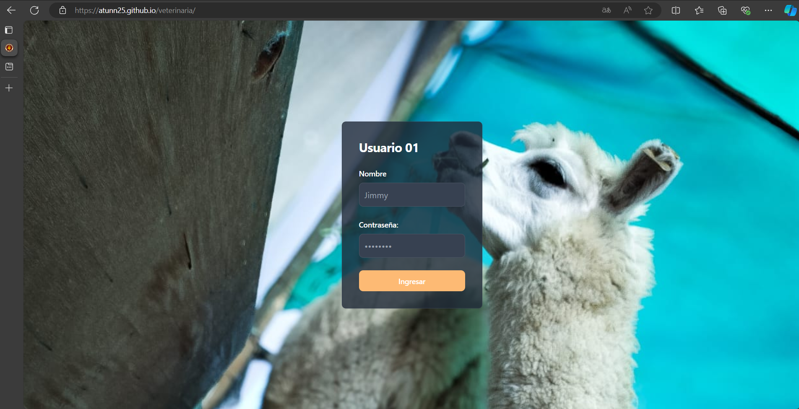
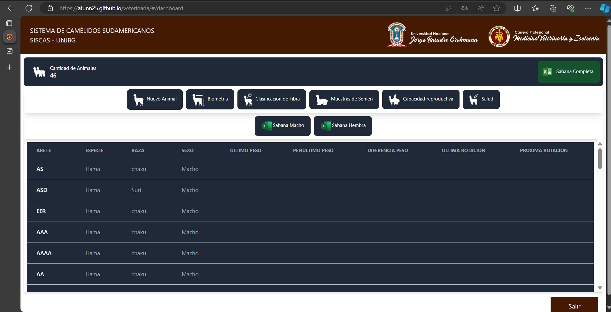

# SISTEMA DE CAMELIDOS SUDAMERICANOS EN LA UNIVERSIDAD NACIONAL JORGE BASADRE GROHMANN

## Descripción
El proyecto consiste en la creación de un sistema web para el registro de camélidos sudamericanos en la UNJBG. Este proyecto fue desarrollado por: 
  
Estudiantes de la "Escuela Profesional de Ingeniería en Informática y Sistemas"
- mi persona **Frank Chaparro**(Desarrollador)
- [Sandro Bailon](https://github.com/m4wi) (Desarrollador)
  
Estudiante de la "Escuela Profesional de Veterinaria y Zootecnia"
- **Jimmy Flores**, alumno de la .
  
Jimmy Flores fue quien solicitó el desarrollo del software, con quien tuvimos una interacción constante a lo largo de un período de dos semanas, siguiendo una metodología ágil para asegurar que el sistema cumpliera con los requisitos establecidos. El sistema utiliza React + Vite para el Frontend, Node + Express para el Backend, y PostgreSQL como gestor de Base de Datos.

## Requerimientos principales
  - Uso de una base de datos.
  - Exportacion de Sabanas de los registros , tanto generales,animales machos y hembras.
  - Login.
  - Implementacion de los formularios para Anadir animal,Biometria,Clasificaicon de Fibra,Muestras de semen, capacidad Reproductiva y Salud.
  - Verificacion de que los datos esten completos en los formularios.
  - Tabla principal con datos generales(Cod Arete,sexo,especie,raza,sexo,...).
  - Diseño Responsive

## Login

  

## Dashboard

  

## Tecnologias Usadas
  - React 
  - Vite
  - TypeScript
  - Tailwind CSS
  - Express
  - PostgreSQL
  - GitHub Pages (para el despliegue)
  - Railway
  - GitHub

## Observaciones
  - El presente trabajo se dividio en 3 capas, este Repositorio en si es la parte Frontend con Vite + React + TypeScript , se uso GitHubt para el despliegue, en cuanto a mi labor fue encargame el desarrollo del Frontend , respecto al Backend + Base de datos estan subidas en Railway de manera gratuita por 1 mes.
    
  - El acceso al sistema está restringido y únicamente autorizado para Jimmy, el cual será el único usuario con credenciales para ingresar al sistema. Esto se debe a que el sistema cuenta con un mecanismo de autenticación (login) que garantiza que solo los usuarios autorizados puedan acceder a las funcionalidades del mismo.

